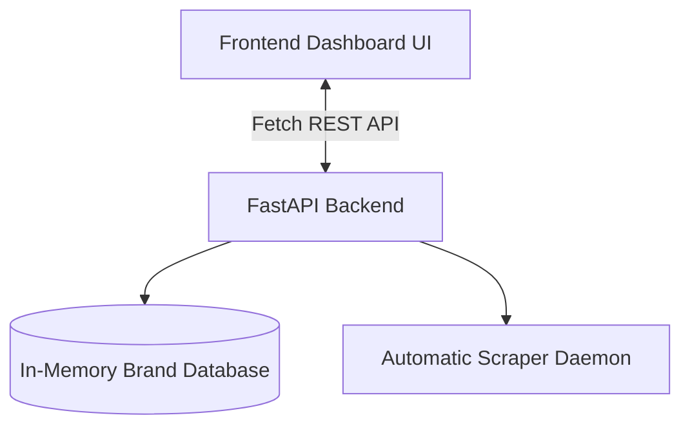

# Implementation Plan: BrandPulse - Full Brand Sentiment & Metrics Tracker

A complete, feature-rich sentiment and brand tracking dashboard for small businesses. The application is expanded to show comprehensive details: brand profile, interactive filterable feed, keyword/topic analytics, competitor comparisons, and a simulated live crawler.

---

## Expanded Features & Layout

### 1. Brand Profile & Settings
- **Brand Info Card**: Displays the active brand name, logo, industry, and handles (Instagram & Twitter).
- **Edit Settings Modal**: A panel allowing users to change the brand context (e.g., café, clothing store, software startup) and social handles, updating all calculations instantly.

### 2. Interactive Filtering & Search
- Filter the **Mentions Feed** by platform (Instagram, Twitter) or Sentiment (Positive, Neutral, Negative).

### 3. Detailed Sentiment Breakdown & Keyword Insights
- **Key Topics Cloud**: Visualizes frequently mentioned keywords (e.g., "pricing", "delivery", "quality") and marks their sentiment color.
- **Competitor Sentiment Matchup**: Displays a chart comparing the brand's sentiment score against competitors (e.g., "Competitor A", "Competitor B").

### 4. Live Scraper Simulator
- A toggle button to run an **Auto-Tracker**. When enabled, it simulates real-time crawling by fetching or generating a new social mention every 10 seconds, causing the dashboard, metrics, and charts to update live.

---

## Technical Architecture & Schema Upgrades

---

## Proposed Changes

### 1. Backend Upgrades (`backend/main.py`)
- **Brand State Management**: Store the active brand settings (name, handles, industry) and return them via `GET /api/brand`.
- **Update Settings Endpoint**: `POST /api/brand` to update name, industry, handles.
- **Competitor Data Endpoint**: `GET /api/competitors` returning sentiment scores of competing brands.
- **Simulated Auto-Crawler Endpoint**: `POST /api/mentions/crawl` which triggers a mock search index crawl to pull a fresh comment from social platforms.

### 2. Frontend Upgrades (`frontend/index.html`, `frontend/style.css`, `frontend/app.js`)
- Add **Brand Profile settings form** and **Competitor analysis cards**.
- Implement **Filter tabs** in the Engagement Feed.
- Integrate **Competitor Bar Chart** and **Sentiment Pie/Donut Chart** in Chart.js.
- Custom CSS grids to layout the additional analytics columns.
